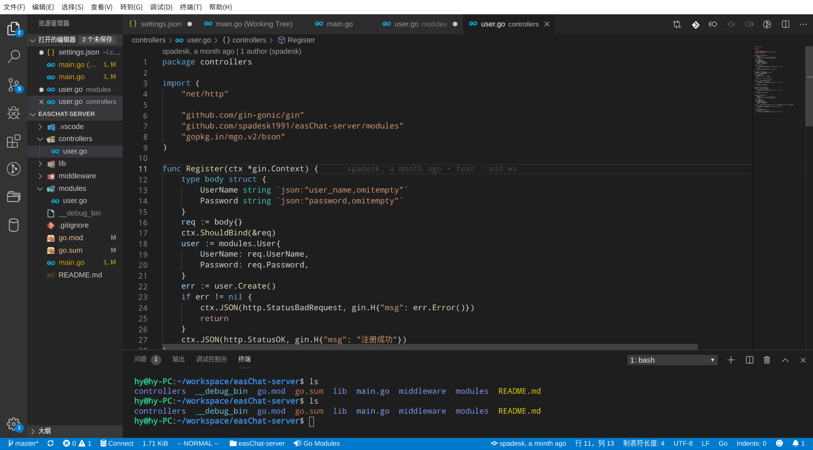

# go-swagger README

## config swagger
### default config
```json
// @Summary 登录
// @Description 登录
// @Produce json
// @Param body body controllers.LoginParams true "body参数"
// @Success 200 {string} string "ok" "返回用户信息"
// @Failure 400 {string} string "err_code：10002 参数错误； err_code：10003 校验错误"
// @Failure 401 {string} string "err_code：10001 登录失败"
// @Failure 500 {string} string "err_code：20001 服务错误；err_code：20002 接口错误；err_code：20003 无数据错误；err_code：20004 数据库异常；err_code：20005 缓存异常"
// @Router /user/person/login [post
```
### change config
```json
{
    "swagger.tpl":"// @Summary 登录\n// @Description 登录\n// @Produce json\n// @Param body body controllers.LoginParams true \"body参数\"\n// @Success 200 {string} string \"ok\" \"返回用户信息\"\n// @Failure 400 {string} string \"err_code：10002 参数错误； err_code：10003 校验错误\"\n// @Failure 401 {string} string \"err_code：10001 登录失败\"\n// @Failure 500 {string} string \"err_code：20001 服务错误；err_code：20002 接口错误；err_code：20003 无数据错误；err_code：20004 数据库异常；err_code：20005 缓存异常\"\n// @Router /user/person/login [post]\n"
}
```
## Use
